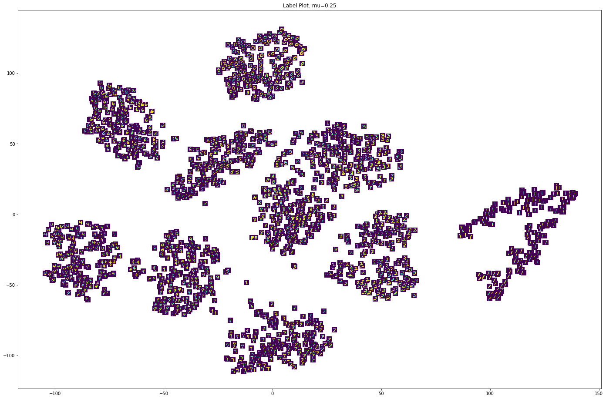
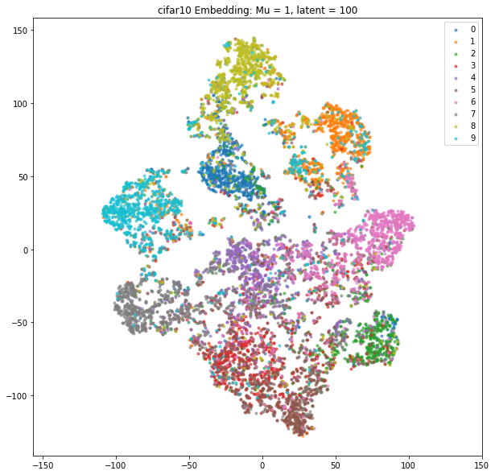

# Learning weakly-supervised metric embeddings

## Summary

This repository documents some experiments with siamese/triplet autoencoders,
and siamese _variational_ autoencoders. The goal of these experiements was to
learn interesting, semantically meaningful low-dimensional representations of
the data by:

1. Combining the self-supervised properties of an autoencoder (variational or
otherwise) to generate low-dimensional latent representation of the data
2. Refining the obtained latent representation using contrastive methods on
groups of points sampled from the latent space and presented as either pairwise
or triplet constraints.

For reference, pairwise constraints are tuples of the form (A, B) where data
points A and B are considered "similar", while triplet constraints are tuples of
the form (A, B, C) where B is more similar to A than C.

## Rationale

Contrastive methods are a popular way to learn semantically meaningful
embeddings of high dimensional data. Intuitively, any reasonable embedding
should embed similar points close together and dissimilar points far apart -
contrastive methods build on this intuition by:

1. penalizing large distances between points tagged _a-priori_ as similar
2. penalizing small distances (i.e. distances less than some _margin_) between
points tagged _a-priori_ as dissimilar.

This method is not without its flaws - most notably, blindly moving "similar" points 
closer together erases the intra-class variance, which might be something we are 
interested in. 

One possible solution to this would be to replace regular Siamese/Triplet Networks with
Siamese/Triplet _autoencoders_; the reconstruction accuracy constraint should help somewhat
in preserving the structure of the latent space so that similar classes are not collapsed. One
could also use Siamese/Triplet _variational_ autoencoders, which have the additional benefit 
of imposing a Gaussian prior on the shape of the latent space. 

Overall, we are simultaneously minimizing two losses: the contrastive or triplet loss within the
latent space, and the reconstruction error. These losses are balanced with a weighting parameter M. 
As M tends to 1, we approach the behavior of a regular siamese/triplet network; as M tends to 0, we approach
the behavior of a regular autoencoder/VAE. 

## Usage 

Example can be found in `run.py`:

``` 
all_results = run_experiment("pairwise", "vae", "cifar10", [0.75], [3], 
                             num_iters=10, batch_size=32, normalize=True,
                             feature_extractor='hog')

```

Parameters:

1. `constraint_type`: Simulation type. Accepts either "pairwise" or "triplet"
2. `encoder_type`: Network type. Accepts either "embenc" (regular autoencoder) or "vae"
3. `dataset`: Dataset name. Accepts "mnist", "cifar10" and "imagenet"
4. `list_of_weights`: list of mu values for which experiment is to be run.  
5. `list_of_latent_dims` (list): list of latent dimensions for which experiment is to be run.  
6. `batch_size`: batch size from which pairs/triples are generated. Defaults to 64.
7. `keys`: Mapping from numeric labels to string label names. Defaults to None. Used in visualizing.
8. `composite_labels`: Maps current labels to composite labels, i.e. when multiple classes are to be merged. 
9. `margin`: Margin to be used for metric loss. Defaults to 1.
10. `dropout_val`: dropout value for networks. Defaults to 0.2.
11. `num_iters`: number of iterations. Defaults to 20000.
12. `normalize`: Whether or not to normalize the data. 
13. `feature_extractor`: the type of feature extractor to use. Supports `'resnet'` (features extracted from pre-trained ResNet50) and `'hog'` [(histogram of oriented gradients)](https://ieeexplore.ieee.org/document/1467360)


## Results



Figure 1: Results from running the VAE variant with Pairwise Constraints on MNIST with the raw pixels as input. The inter- and intra-class variance are clearly preserved. 




Figure 2: Results from running the deterministic autoencoder variant with Pairwise constraints on CIFAR10, with features extracted from a pre-trained ResNet50. Each number refers to one of the classes in CIFAR10. Interestingly, all the machine classes are embedded closer together than the animal classes.


